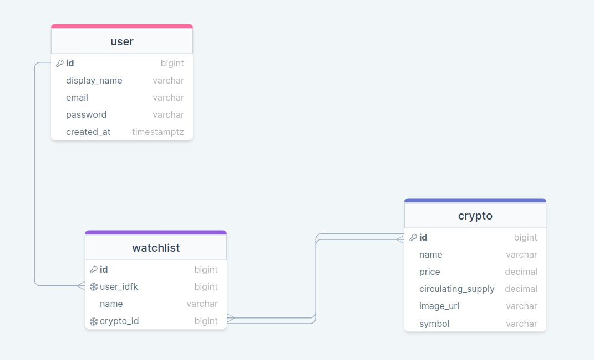

---cointrax---

What it is: An app that tracks cryptocurrency market data.

Features: - users can log into their account (authentication) - users can view all cryptocurrencies available through an API - users can create multiple watchlists (ex. top 3, memecoins, project-focused, etc)
-users can add multiple coins to their watchlists

    CRUD:
        -create watchlists
        -read market data
        -update watchlists
        -delete watchlists

